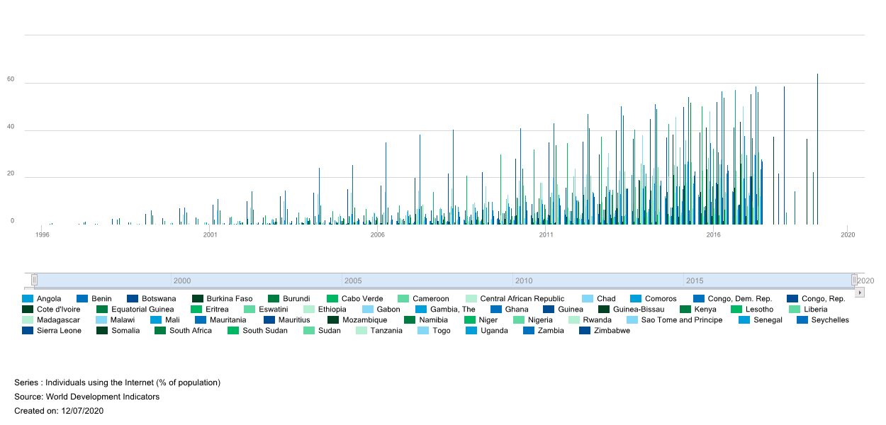

#  Change of Internet Capabilities Throughout the World

- [ ] geographical challanges are not discussed, you cannot see this from just looking at data papers
- [ ] structure f the paper coudl be improved
- [ ] paper almost reads like two papers, why chose africa and not Asiz, pacific islands, your title is "world"

Status: final

Matthew Cummings, [fa20-523-334](https://github.com/cybertraining-dsc/fa20-523-334/), [Edit](https://github.com/cybertraining-dsc/fa20-523-334/blob/main/report/report.md)

{}

# Abstract 

In 2050 the United Nations is projecting that 90% of the world will have access to the internet. With the recent pandemic and the shift to most things being online we see how desperate people need internet to be able to do everyday tasks. The internet is a valuable utility and more people are getting access to it every day. We also are seeing more data is being sent over the internet with more than 24,000 Gigabytes being uploaded and processed per second across the entire internet. In this report we look at the progression of the internet and how it has changed over the years.

Contents



{}

**Keywords:** internet, internet development, progression of internet, population, data analysis, big data, government

# 1. Introduction 

Everyday people throughout the world connect to the internet with speeds never before seen. The internet has not always been this way and for some countries they are still not at the same speeds. The internet started out to be a slow connection of one computer to the other with large machines helping pass the data. This quickly changed to become a vast network of computers all connected to one another and using packet processing systems to transport data. With the internet seen as a new and important technology governments and companies soon started their own development of networks and expansions. These expansions and networks would be the ground work for what we call the internet today.   

With the United Nations projecting that 90% of the entire population will have internet in 2050 and currently only 50% of the entire population [^17] this work will look at how we started this movement and in what areas we need to improve on. Currently about 87% of American’s have access to the internet and use it daily while other countries like Chad only have 6.7% of their population using the internet. This can is from the vast resources America used to expand their networks and create the ideal internet connection that other countries strive to have. While other underdeveloped countries are trying to catchup and build their own infrastructure in the modern age, first world countries, like America, are expanding their networks to be better and more reliable. **Figure 1** shows the current status of the percentage of the population in each country that has internet. Dark blue color is the best with greater than 70% of their population having internet access while the lighter blue is countries whose population is less than 18%.

  

**Figure 1:** Shows the current percentage of the worlds population that has/uses internet within each country [^17].   

# 2. Background and Current Works

In 1965 Thomas Merrill and Lawrence G. Roberts started the first ever wide-area computer network ever built. The internet first started out as huge machines that were sizes of small houses that were only capable of transferring small amounts of data or packets as they soon invented. The internet at the time was not even called internet but the Advanced Research Projects Agency Network (ARPANET). This Network backed by the U.S. Department Of Defense used node-to-node communication to send a messages. The first test was a simple test of sending the message of “LOGIN” from one computer to the other. It crashed after “LO” was sent. Following this devastating start improvements were made with the capabilities of that these computers could perform. With data now being sent throughout the network researchers needed to develop a standard on how packets should be sent. This is when the transmission control protocol and internet protocol (TCP/IP) was invented. It was soon adopted into the APARTNET in 1983 and became the standard on how computers should send and process data [^5]. TCP/IP is how packets are sent all over the internet. This system uses the packet-switched network where information is broken into packets and sent to different routers, the IP section of the system, and following the packets it was then put back together on the receiving end and resembled into what it was originally, TCP [^3].   

When the internet was developed there was many different communities and the growth of these communities brought problems. There was no one group or organization that organized these groups and all these communities were on different platforms and areas. This is when the Internet Activities Board (IAB) and Tim Berners-Lee from MIT came together to develop the World Wide Web (WWW) and its primary community of World Wide Web Consortium (W3C). W3C is now the primary group who make protocols and standards for the WWW. This group is still actively watching and helping the WWW to make sure it is growing steadily and supported throughout the internet [^5].

# 3. Dataset 

To compare countries internet usage and how many people in each country use the internet two datasets will be used. These datasets will look at the percentage of the population that has internet access [^15] and the percentage of the population that use smartphones [^16] as that is another way people can access the internet. Once the data has been analyzed we looked at why the data is like this and how the data has changed to the way it is now. 

# 4. Data Within Internet

The internet has progressed largely from not being able to send a simple message like “LOGIN” from one computer to another to being able to process terabytes of data. We are now seeing 24,000 gigabytes per second being passed and uploaded throughout the internet [^7]. To give perspective on this 1 gigabyte can hold up to 341 average sized digital pictures, or one megabyte is equal to 873 plain text pages and there are 1000 megabytes in 1 gigabyte. That is 873,000 pages of plain text per gigabyte and the internet is sending and uploading about 24,000 gigabytes per second, that is 24,952,000,000 pages of plain text pages being sent over the internet. This large quantity of data and information is passed throughout the internet every second and usually without any hiccups or data issues. This data and information has not always been here [^2]. Most of it is relatively new with 90% of most data on the internet being created post 2016. This data is still growing and will continue to grow. With more than 4.4 billion people on the internet all these users are pumping more data and this data is being passed around other users. With 7.5 billion people on earth almost 60% of people on earth are using the internet and are contributing to the amount of data on it. This change has not been a slow change but an explosion of change and new users. In 2014 there was only 2.4 billion users on the internet. Within 5 years we see a growth of 2 billion users and with that we see an ever increasing amount of data being sent and uploaded [^7]. Some of this data is being stored and used throughout the world every day and we have companies like Google, Facebook, Amazon, and Microsoft who store this data. Between them it is estimated that they store 1.2 million terabytes of internet data. Just looking at these 4 companies we see the magnitude of the data that is being stored and kept throughout the internet and each day these numbers grow [^7]. To give some perspective on how large that data storage is 1 Terabyte is 1000 gigabytes of data. Cisco even estimates that there has been over 1 zettabyte of data created and uploaded on the internet in 2016, zettabyte is 1000 exabytes an exabyte is 1000 petabytes and a petabyte is 1000 terabytes [^8]. That is a lot of data and information being sent and passed throughout the internet. It is also estimated that in 2018 we have reached 18 zettabytes. We see the growth of this data being passed throughout the internet in 2 years from being 1 zettabyte to being 18. This growth will not stop or slow down but continue to expand and grow as it is being predicted to be about 175 zettabytes within the year 2025. *That is enough information to store on DVDs that can circle the earth 222 times* [^8]. Now this data is not all being stored but just uploaded or sent to other users. With an overwhelmingly number of this data coming from the social media companies and posts people are sending to each other. We are also seeing the growth within searches with Google getting over 3.5 Billion searches every day. We will see how this data came to be and how the internet slowly took over the world.

## 4.1 Data Analysis of Internet Change

Using the datasets [^15] we can analyze how this transition took place throughout the world and how the internet progressed. Looking at 2017 data we see that all first world countries have more than 70% of their population using the internet but other countries are still struggling. Looking at the progression of the internet we see that America started off the strongest and most explosive growth out of all countries and has maintain that growth while other countries and continents have fallen behind. We will look at how the internet started so strong in America and how it has teetered in other parts of the world. 

# 5. How America Started the Spread of the Internet

Looking at the 1990’s data we see that America is at .79% of the population having internet while the entire world as a whole is less than .0495%. The only countries who are close to America is Norway, Canada, Sweden, Finland, and Australia. These countries populations are all less than American’s percentage with Norway the closest at .7%. **Figure 2** shows these percentages and how drastic these differences are with some countries having 0% of their entire population having access to the internet [^15]. How is America and these five countries populations have so many more users using the internet compared to the rest of the world?  

  

**Figure 2:** This figure shows the 1990’s current population % of people accessing the internet [^17].

## 5.1  America’s Population Data

With the WWW being developed and deployed within America it makes sense that America would be the first country to expand their internet and have a larger portion of their population using the internet over the rest of the world. The dramatic difference of America having .79% of their population over the worlds .0495%, America was able to drastically take advantage of their early start and develop it to their needs. When looking at the world’s population with internet compared to America’s, American population with internet accounts for more than half of the world’s population with internet, with America’s population being 250 million in 1990’s and .79% of their population having internet that means 1.975 million people had internet in America while only 2.614 million globally had internet [^15]. America at the time was a leader in the world on internet and it is interesting how it got there. 

## 5.2 How America Started the Network and Government Help 

With the development of APARTNET within the United States the Government saw the opportunity to help expand it within its own country. The U.S. Government helped the expansion of the internet by financing contracts and building satellite sites across the world to gain access to the internet. These sites where built mostly in military bases across the world and helped countries tap into the internet without the huge cost of infrastructure . The Department of Defense (DOD) also saw an opportunity in the new Internet with their creation of MILNET. MILNET connected numerous military compounds and their computers to the United States main hub. These connections used the APARTNET but were able to disconnect and use its own network if it became compromised. These connections made it able for the internet to spread to different countries since the United States military is set up in so many countries and have bases all over the world. Most of these connections were prioritized in the United States allied  countries like Norway, Australia, Canada, and EU hence why these countries have a large population using their internet in 1990, **Figure 2**. All the infrastructure was already set up because of the military bases and the satellites the United States built for it. These countries took advantage of it and connected their people to the internet for the fraction of the cost [^9].

## 5.3  National Science Foundation Involvement 

The internet also progressed quickly to these countries and throughout the United States population because of the use of super computers which helped the connections and speed of the internet. The Reagan administration saw an important need to develop these super computers that could broaden the connection and networks of the computers. National Science Foundation (NSF) had a super computer already on their network but with the help of the administration they were able to expand that network to all internet users. The new network that NSF developed was the NSFNET. This network connected academic users to the super computer and those computers to other computers. Creating this intertwined network that was all able to use the speed and power of a super computer. It expanded the speed to be 1.5 megabits per second and would replace the APARTNET network which only could handle 50 kilobytes per second. Because of NSFNET we saw an explosion of growth within the internet with it growing over 10% each month in 1990. This is why United States had so many more users than any other country because they were able to use this faster and better network. NSF saw the need to expand elsewhere and used the NSFNET to start connecting the world globally. Using the pre-installed infrastructure of the old Satellite internet they were able to connect countries that already had internet with ease. This is why the American allies were able to have so many of their own population on the internet when comparing it to the world [^9].

## 5.4 Summary of Government Involvement 

Without the direct involvement of the United States Government the internet would have had a slower progression than the one we are seeing today. Without the military and the NSF the internet would not have been the same and could have looked a lot different. We would not have had the same widespread start without all the military bases having all the required infrastructure for the internet and we would not have had the required needs for the internet because of the vast contracts that the military supplied. This is how America was able to be so far ahead of the rest of the World and why the American allies were able to also build up their own infrastructure and take advantage of the infrastructure supplied by America. We also would have had a lot slower internet if it was not for America and the connection of the super computers on the networks. 

# 6. Africa’s Struggles to get Continent Wide Internet

Looking at the data within Data World Bank we can see the vast change within countries. Some countries populations double how many people are using the internet each year. One region to look at specifically is Africa. Africa did not have each country within it have internet until 2000. That is 20 years after the start and development of the internet. When looking at the entire population of Africa only 16.18% of the them had internet access or used internet access. Comparing this America’s 43.1% and Canada’s 51.3% we see a huge disparity here. We also see that the Average population that uses internet in Africa being .385%. This is dramatically low but given that Africa is an underdeveloped country and has had lots of struggles makes sense. 

## 6.1 How did Africa get their Internet?

It started very early with Africa getting the first computer in 1980’s. This computer started how their network would work and how they would setup their own infrastructure. Most of the universities in Africa were the ones who lead the new technology age for Africa. These universities became the hotspots for computing and the internet. Africa also got some major help from the Internet Society [^10]. The Internet Society is a nonprofit organization that helps people connect to the internet and can help countries setup their own networks [^5]. In 1993 the Internet Society held a large workshop that helped a lot of underdeveloped countries connect to the internet and teach them all how to supply their population with this critical utility. Each following year the workshop hosted a new event which grew in size and over 447 citizens attended it who were from African Countries. This helped bring the discussion how Africa can setup their network and get their people the vital resources they need [^10]. Africa has also gotten help from other countries to help develop their infrastructure and get their internet systems going. On major help was America’s USAID LELAND initiative which supplied Africa 15$ million to help develop their infrastructure. This agreement made it possible for African countries to develop primary connections to their own networks from USA’s high speed network. With this deal that started in 1996 and ended in 2001 we see a large spike in the populations and countries who finally have access to internet [^13]. With the help of this resource Africa was able to start developing their own network organization for all of Africa called AfriNIC. AfriNic is similar to America’s IAB were they help to make sure the networks are open to everyone within Africa and that if there are issues they are solved. Africa began to develop into the modern age of the internet with this and started to catch up to others [^10]. 

## 6.2 Current Trends and Future for Africa

Looking at the recent data for World Data Bank we see that African countries have been having a comeback with the amount of people using the internet. Currently Africa has seen a large spike in people using the internet. This can be because of all these programs that have helped start its program but it is can also be from two-thirds of the population having phones that can connect to the internet. Africa still has a problem with less than 50% of its entire population having access to internet and a computer. There are still a lot of struggling countries like Niger that only have 5.3% of it is population that use and connect to the internet. Within this day and age having access to the internet is almost critical to survive and be apart of the world. With only 5.3% of their population having internet they are still struggling to have access for everyone. Comparing this to current America with 83% of the population having internet Africa is still far behind the curve of first world countries. This lack of internet has created an opportunity of some people to help or take advantage of Africa’s lack of infrastructure. China’s Company Huawei has agreed to build the first ever 5G network within Africa. This network will help the current population of phone users to connect to higher speeds and see a great increase in use of the internet. American countries Vanu and Parallel have also been tackling this issue with new network plans and innovative ideas to help Africa’s internet networks expand to the vast region. With a projected $160 Billion annual cost to develop and maintain a country wide infrastructure a lot of people believe they need more than just companies to help them [^15]. With no more help from outside countries it looks grim for Africa’s continued growth within the internet unless more companies come try to develop their own system and networks. Looking at **Figures 3** we see how African countries have had a much slower progression towards internet when compared to other countries, **Figure 4** shows America’s progression. **Figure 5** also depicts the current status of Africa and how most countries within Africa are still below 18% of their population using internet within the current day and age. 

**Figure 3:** Seeing these countries all below 50% while major countries are over 70%-80% depicts how far behind Africa is within the internet. We can also see the change and growth of the internet within these countries and compare it to other countries. Comparing it to America’s growth they are nowhere near as explosive or close to being the current rate of America’s internet growth [^17]. 

**Figure 4:** America’s growth within the internet [^17].

**Figure 5:** This is the current status of Africa’s internet population percentage. Notice that most countries within Africa are less than 18% while the world population % is greater than 50%. This depicts how far behind Africa is with building their infrastructure [^17]. 

## 6.3 Summary of Africa’s Internet 

With less help from outside countries Africa is almost on their own with decided how they should improve their Internet Capabilities. Companies are see this as an opportunity to develop and use their own technologies to help Africa with their issues. These companies will develop a new network to try and get the entire country connected and online. This could be a problem were Africa is not entirely in control of their internet and data but with no outside help from any other countries they might have to take the best options available and go with these companies. With the help of Internet Society and AfriNET Africa has already started developing programs and networks to connect the country but with the infrastructure cost being to high they still need help. These organizations could help maintain oversite within this work and make sure Africa does not get taken advantage of. As the world progresses to complete internet involvement Africa is still far behind the rest. 

# 7. Conclusion 
 
After viewing the data and analyzing trends the team saw the large differences between countries with who had an early start within the area of internet development and those countries who are far behind. Analyzing the reason behind this we see that countries who had access to the internet early and were able to take advantage of their early start were able to have a much larger population percentage than the countries who did now. We also see that some countries would get help from outside countries but when those contracts expired they were left out to dry. Seeing America and the vast amount of allies it had in 1990’s-2000’s with their population with access to internet quadrupling those in less developed countries is staggering but when looking behind the data and the reason why we see that some countries are just not as equally equipped and don’t have the infrastructure to compete with other countries networks. With 90% of the population being projected to have access to the internet it will be interesting to see the change in these areas. As we get closed to that 90% it will be these less developed countries who will make staggering changes within their percentage of population compared to the other developed countries. 

## 7.1 Limitations

With only one large dataset that had all the population sizes and percentages it can be difficult to check the accuracy of the data within the set. The datasets also contained a numerous amount of null data and/or incomplete data for a vast majority of countries. This hindered the ability to further look at the correct trends and analysis of the dataset. With also having not a vast knowledge of data analysis within data the team was not able to analyze the datasets for the planned project. 

## 7.3 Future Work

The team will continue to analyze these datasets and build their own programs to look see the different trends within these areas and countries. The team wants to keep working on the reason why they trends are happening and how these trends started. It is important to understand the reason behind the data and factors that lead to these data points. As the team progresses through the dataset, the team will continue to understand the factors and reasons within the data.

# 8. Acknowledgements

The author would like to thank Dr. Gregor Von Laszewski, Dr. Geoffrey Fox, and the associate instructors in the *FA20-BL-ENGR-E534-11530: Big Data Applications* course (offered in the Fall 2020 semester at Indiana University, Bloomington) for their continued assistance and suggestions with regard to exploring this idea and also for their aid with preparing the various drafts of this article.

# 9. References

[^1]: W. F. X. Company, “The Internet in Real Time,” The Internet in Real Time: Web Usage Stats Per Second, 2020. [Online]. Available: https://www.webfx.com/internet-real-time/. [Accessed: 12-Nov-2020].

[^2]: R. Company, “Byte Size Infographic: Visualising data,” redcentric, 03-Feb-2020. [Online]. Available: https://www.redcentricplc.com/resources/byte-size-infographic/. [Accessed: 13-Nov-2020].

[^3]: B. Company, “TCP/IP,” Encyclopædia Britannica, 2018. [Online]. Available: https://www.britannica.com/technology/TCP-IP. [Accessed: 15-Nov-2020].

[^4]: E. Andrews, “Who Invented the Internet?,” History.com, 18-Dec-2013. [Online]. Available: https://www.history.com/news/who-invented-the-internet. [Accessed: 15-Nov-2020].

[^5]: B. Leiner, V. Cerf, D. Clark, R. Kahn, L. Kleinrock, D. Lynch, J. Postel, L. Roberts, and S. Wolff, “Brief History of the Internet,” Internet Society, 14-Aug-1997. [Online]. Available: https://www.internetsociety.org/internet/history-internet/brief-history-internet/. [Accessed: 07-Nov-2020].

[^6]: G. Mitchell, “How much data is on the internet?,” BBC Science Focus Magazine, 2020. [Online]. Available: https://www.sciencefocus.com/future-technology/how-much-data-is-on-the-internet/. [Accessed: 07-Nov-2020].

[^7]: J. Schultz, “How Much Data is Created on the Internet Each Day?,” Micro Focus Blog, 08-Jun-2019. [Online]. Available: https://blog.microfocus.com/how-much-data-is-created-on-the-internet-each-day/. [Accessed: 07-Nov-2020].

[^8]: B. Marr, “How Much Data Is There In the World?,” Bernard Marr, 2020. [Online]. Available: https://www.bernardmarr.com/default.asp?contentID=1846. [Accessed: 07-Nov-2020].

[^9]: R. E. Kahn, Revolution in the U.S. information infrastructure. Washington, D.C., DC: National Academy Press, 1995. Chapter The Role Of Government in the Evolution of the Internet [Accessed: 12-Nov-2020].

[^10]: Afrinic Organization, “A Short History of the Internet in Africa (1980-2000),” AFRINIC BLOG, 26-Sep-2016. [Online]. Available: https://afrinic.net/blog/153-a-short-history-of-the-internet-in-africa-1980-2000. [Accessed: 05-Dec-2020].

[^11]: I. F. C. Organization , “Brining Africa Up to High Speed,” Request Rejected, Aug-2019. [Online]. Available: https://www.ifc.org/wps/wcm/connect/news_ext_content/ifc_external_corporate_site/news and events/news/cm-stories/cm-connecting-africa. [Accessed: 05-Dec-2020].

[^12]: B. Okunoye, “Building an Internet of Opportunity for Africa,” Council on Foreign Relations, 2018. [Online]. Available: https://www.cfr.org/blog/building-internet-opportunity-africa. [Accessed: 05-Dec-2020].

[^13]: I. Society , “History of the Internet in Africa,” Internet Society, 04-Aug-2020. [Online]. Available: https://www.internetsociety.org/internet/history-of-the-internet-in-africa/. [Accessed: 05-Dec-2020].

[^14]: M. Tuerk, “Africa Is The Next Frontier For The Internet,” Forbes, 08-Jun-2020. [Online]. Available: https://www.forbes.com/sites/miriamtuerk/2020/06/09/africa-is-the-next-frontier-for-the-internet/?sh=c11d53249001. [Accessed: 05-Dec-2020].

[^15]: W. Bank, “Individuals using the Internet (% of population),” Data, 2017. [Online]. Available: https://data.worldbank.org/indicator/IT.NET.USER.ZS?most_recent_value_desc=true. [Accessed: 07-Oct-2020].

[^16]: W. Bank, “Mobile cellular subscriptions (per 100 people),” Data, 2017. [Online]. Available: https://data.worldbank.org/indicator/IT.CEL.SETS.P2?most_recent_value_desc=true. [Accessed: 07-Oct-2020].

[^17]: Figures used from The Data World Bank. W. Bank, “Individuals using the Internet (% of population),” Data, 2017. [Online]. Available: https://data.worldbank.org/indicator/IT.NET.USER.ZS?most_recent_value_desc=true. [Accessed: 07-Oct-2020].
